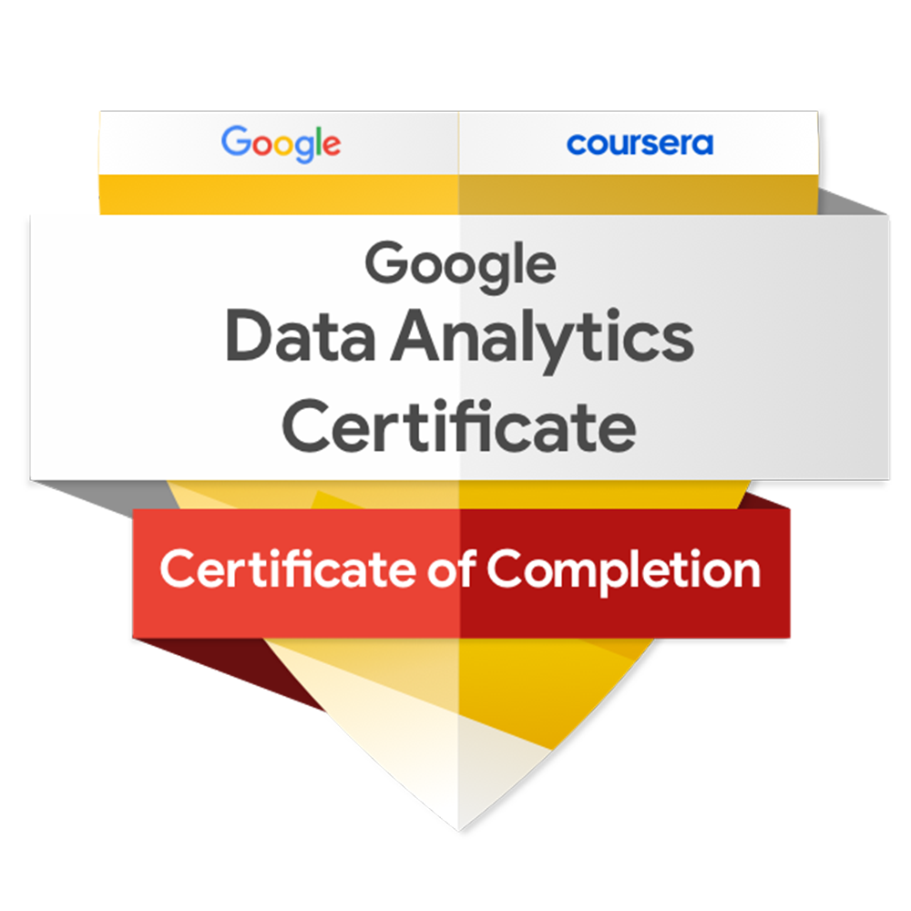
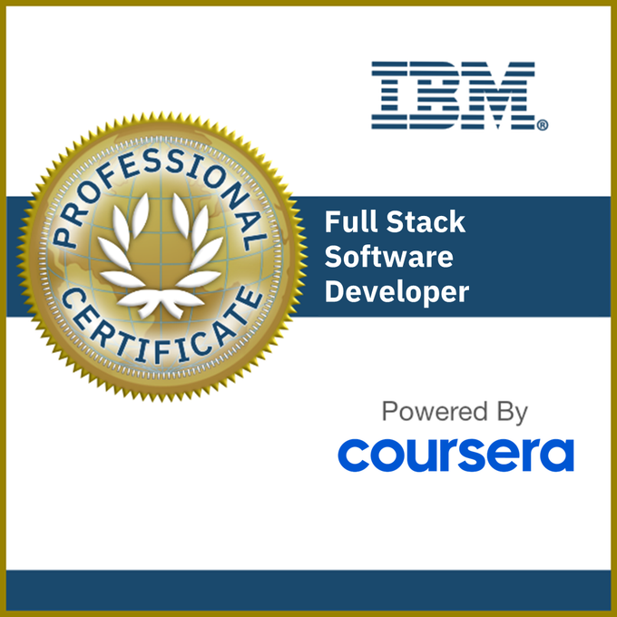
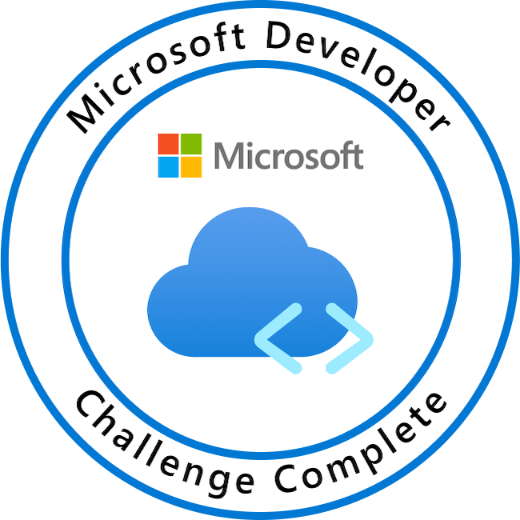

# 👋 Hi, I'm Frank — The Code Boy

Welcome to my GitHub profile! I'm a full-stack developer and data analyst based in Kenya, passionate about building scalable web apps, visualizing data, and crafting clean, reusable code. I thrive on turning ideas into interactive experiences—whether it's a sports portal, a machine learning toolkit, or a game engine.

---

## 🧠 What I Do

### 💻 Developer

- 🛠️ **Python Scripting & Automation** — Clean, reusable scripts for logic and workflows  
- 🌐 **Django Web Development** — Scalable apps with clear structure and professional polish  
- 🎮 **Pygame Projects** — Modular game systems with interactive mechanics  
- 📚 **Documentation & Licensing** — Badge-rich READMEs, MIT licenses, and open-source best practices  

### 📊 Data Analyst

- 📈 **Exploratory Data Analysis (EDA)** — Uncover trends, patterns, and outliers with precision  
- 🧠 **Machine Learning** — Supervised & unsupervised models with strong preprocessing pipelines  
- 🗺️ **Data Visualization** — GeoJSON maps, Plotly dashboards, and custom visual storytelling  
- 🧮 **Statistical Thinking** — Hypothesis testing, feature engineering, and model evaluation  

---

## 🌍 Live Projects

- 🏟️ [SportsSite](https://billydisu.pythonanywhere.com) — Django-powered sports portal with media, user auth, and commentary  
- 🧰 [Portfolio Site](https://OlumPortfolio.pythonanywhere.com) — Personal showcase and contact hub

---

## 🚀 Featured Repositories

| Project | Description | Tech |
|--------|-------------|------|
| [`SportsSite`](https://github.com/frankTheCodeBoy/sportssite) | Live Django sports portal with media, user auth, and commentary | Django, Python |
| [`UpdatedPageHse`](https://github.com/frankTheCodeBoy/UpdatedPageHse) | Modular Django scaffold with reusable apps | Django, Python |
| [`GeoJSON_Visualizer`](https://github.com/frankTheCodeBoy/Realtime_API_Data_And_Earthquakes_Visualisation) | Interactive map visualizations using GeoJSON and Plotly | Python, Plotly |
| [`ML_Analysis_Toolkit`](https://github.com/frankTheCodeBoy/Data_Science_Machine_Learning_Analysis) | End-to-end machine learning workflows with clean preprocessing | Python, scikit-learn |
| [`Blazor_App`](https://github.com/frankTheCodeBoy/Blazor_App) | EventEase — Blazor WebAssembly app for event management | Blazor, C# |
| [`Full_Stack_Integration_Microsoft_Project_2025`](https://github.com/frankTheCodeBoy/Full_Stack_Integration_Microsoft_Project_2025) | Capstone project with Blazor frontend and secure backend | Blazor, ASP.NET, SQL |

---

## 📈 GitHub Stats

  
    
  

---

## 🏅 Certifications

> Click to view verified credentials and badge details.

  
<strong>📜 Verified Certifications</strong>

   

  ### 🧠 Data & Analytics

  <table>
    <tr>
      <td></td>
      <td>
        📊 <strong>Google Data Analytics Professional Certificate</strong> 
        <em>Google / Coursera</em> 
        Skills: 📊 Spreadsheets | 🐍 SQL | 📈 Tableau | 🧪 Data Cleaning | 🔍 EDA | 📊 Visualization 
        🔗 <a href="https://coursera.org/verify/professional-cert/SLZ7ERDFU7TL">Verify Certificate</a>
      </td>
    </tr>
    <tr>
      <td></td>
      <td>
        🧠 <strong>IBM Data Science Professional Certificate</strong> 
        <em>IBM / Coursera</em> 
        Skills: 🐍 Python | 🧮 SQL | 📊 Data Analysis | 📈 Visualization | 🤖 Machine Learning | 🧪 Capstone Project 
        🔗 <a href="https://coursera.org/verify/professional-cert/V5SPDYXMMDRW">Verify Certificate</a>
      </td>
    </tr>
  </table>

  ### 💻 Full-Stack Development

  <table>
    <tr>
      <td></td>
      <td>
        💻 <strong>IBM Full-Stack Software Developer Certificate</strong> 
        <em>IBM / Coursera</em> 
        Skills: 🌐 HTML/CSS | ⚛️ React | 🐍 Django/Flask | 🐳 Docker | ☸️ Kubernetes | 🔧 DevOps 
        🔗 <a href="https://coursera.org/verify/professional-cert/VQT03FGGBIXY">Verify Certificate</a>
      </td>
    </tr>
    <tr>
      <td></td>
      <td>
        💻 <strong>Microsoft Full-Stack Developer Certificate</strong> 
        <em>Microsoft / Coursera</em> 
        Skills: 🧱 C# | 🔷 Blazor | 🌐 ASP.NET | 🧮 SQL | 🧵 Entity Framework | 🔧 DevOps | 🤖 Microsoft Copilot 
        🔗 <a href="https://coursera.org/verify/professional-cert/PZIW9EU04LNW">Verify Certificate</a>
      </td>
    </tr>
  </table>

   

  ### 🧩 Badge Legend

  | Icon | Domain | Description |
  |------|--------|-------------|
  | 📊 | Data Analytics | Google’s foundational data skills |
  | 🧠 | Data Science | IBM’s full data science toolkit |
  | 💻 | Full-Stack Dev | End-to-end development skills from IBM & Microsoft |

   

  _Last updated: August 2025_
  _Badges sourced from Credly and local assets. All certificates earned via verified platforms._

---

## 📬 Contact Me

- 📧 **Email**: Olumfrank48@gmail.com  
- 📱 **Phone**: +254 734 633 607  
- 🌐 [Portfolio Site](https://OlumPortfolio.pythonanywhere.com)  

---

## 🏁 Philosophy

> “Code is communication. Data is insight. I write mine to be read, reused, and respected.”

---

  <strong>Crafted with clarity, curiosity, and clean code.</strong>  
   
  © 2025 Frank The Code Boy · Nairobi, Kenya  
    

  
  &nbsp;
  
  &nbsp;
  

    
  <em>README hosted in <a href="https://github.com/frankTheCodeBoy/frankTheCodeBoy">frankTheCodeBoy/frankTheCodeBoy</a></em>  
   
  <em>Last updated: August 2025 · All assets and badges are locally sourced or verified</em>

